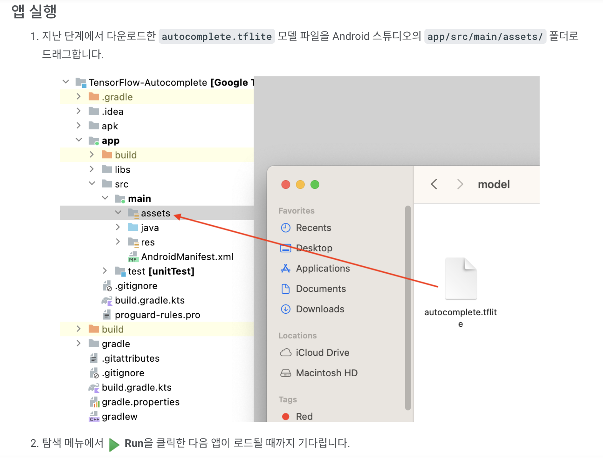

그래서 우리는 TFLite 모델을 준비하고 다운로드했습니다.
42:41
이제 Android Studio로 다시 전환하겠습니다. 여기에 TFLite 파일이 있습니다. 그리고asset 폴더로 드래그하겠습니다. 좋아요. 이제 다운로드가 제 시간에 맞춰 완료되었습니다. 따라서 해당 파일을 Android Studio에 추가한 후 앱을 다시 실행해 보겠습니다. 이번에도 Android Studio는 앱을 빌드하고 앱을 실행하려고 시도합니다.
43:22
자, 이번에는 "I'm favorite a"라는 동일한 간단한 프롬프트를 사용해 보겠습니다. 그리고 대규모 언어 모델을 실행해 보겠습니다. 한 가지 지적해야 할 점은 Android 시뮬레이터의 인터넷 연결이 꺼져 있다는 것입니다. 따라서 모든 것이 기기 내에서 실행되며 데이터가 에뮬레이터를 떠나지 않습니다. 보시다시피, 제안으로 주황색으로 된 여러 단어를 생성합니다.
43:54
그리고 제안을 수락하거나 거부할 수 있습니다. 그것을 받아들이자. 그리고 더 많은 것을 생성할 수 있습니다. 보다? 계속 진행하면 모델이 더 많은 텍스트를 뱉어낼 것입니다. 그리고 문자 그대로 이것을 글쓰기 보조 도구로 사용할 수 있습니다. 좋아요. 하나 더 생성해 보겠습니다. 좋아요. 이것이 우리의 안드로이드 앱입니다. 물론 저는 이것을 Android 에뮬레이터에서 실행하고 있습니다.
44:27
실제 휴대폰으로 자유롭게 작성해 주세요. 작동합니다. 나는 그것을 확신할 수 있다. 좋아요. 이제 Codelab으로 다시 전환해 보겠습니다. 그리고 우리는 이미 Android 앱을 완성했습니다. 그리고 저는 책임감 있는 AI에 관해 정말 중요한 점을 하나 말씀드리고 싶습니다. 그래서 이번 워크숍에서는 GPT-2 모델을 예시 언어 모델로 사용하겠습니다.
44:55
그러나 원래 OpenAI GPT-2 발표에서 언급했듯이 GPT-2 모델에는 주목할만한 주의 사항과 제한 사항이 있습니다. 실제로 오늘날 LLM에는 일반적으로 환각, 공정성 및 편견 문제와 같은 잘 알려져 있고 매우 일반적인 문제가 있습니다. 이는 이러한 모델이 실제 데이터를 기반으로 훈련되어 실제 문제를 반영하기 때문입니다.
45:23
따라서 이 Codelab과 더 나아가 이 워크숍은 TensorFlow 도구를 사용하여 LLM 기반 앱을 만드는 방법을 보여주기 위해 만들어졌습니다. 이 Codelab에서 생성된 모델은 교육 목적으로만 사용되며 프로덕션 용도로는 전혀 사용되지 않습니다. 따라서 모델을 프로덕션 앱에 배포하지 마세요.
45:47
LLM 프로덕션을 사용하려면 교육 데이터 세트를 신중하게 선택하고 포괄적인 안전 완화 조치가 필요합니다. 대규모 언어 모델의 맥락에서 책임 있는 AI에 대해 자세히 알아보려면 Google I/O 2023에서 '생성 언어 모델을 사용한 안전하고 책임 있는 개발' 기술 세션을 시청하세요.
46:09
tensorflow.org에서 Responsible AI Toolkit을 확인할 수도 있습니다. 축하해요! 귀하는 귀하가 입력한 내용을 기반으로 텍스트를 생성할 수 있는 놀라운 앱을 구축하셨습니다. 모든 것이 기기 내에서 실행되며 어떤 데이터도 휴대전화 외부로 유출되지 않습니다. 생각해 보면 이것은 매우 놀라운 일입니다. 이제 회고로서 우리가 이를 어떻게 달성했는지 요약해 보겠습니다.
46:35
우리는 KerasNLP를 사용하여 사전 학습된 GPT-2 모델을 허용하고, 이를 사용자 정의 데이터 세트로 미세 조정하고, 양자화로 최적화하고, TensorFlow Lite로 변환하고, 마지막으로 Android에서 작성했습니다. 이것이 전체 개발 주기입니다. GPT-2가 반드시 실제 사용 사례에서 사용하고 싶은 모델이 아닐 수도 있지만, 이 워크숍에서 배운 기술은 다른 LLM에 적용할 수 있습니다.
47:06
따라서 우리는 귀하가 우리 도구를 사용하여 무엇을 구축할지 매우 기대하고 있습니다. 그럼 이번 워크숍을 시청해주셔서 진심으로 감사드리며, 즐거운 코딩 되시기 바랍니다.